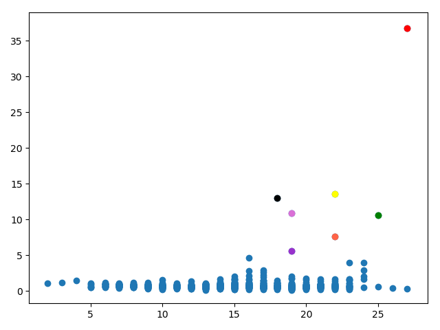
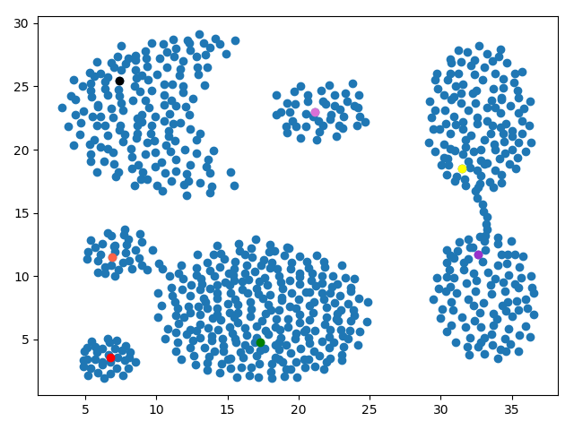
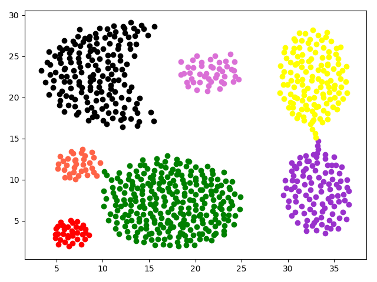

# 实验报告

## 目录

* [数据预处理](#数据预处理)
* [亮点和难点](#亮点和难点)
* [实验结果](#实验结果)

## 数据预处理

将数据转换成 (n_sample, n_feature) 的矩阵，输入。

```python
feature1, feature2 = np.array([]), np.array([])
with open("Aggregation.txt") as file:
    for line in file:
        feature = line.split(",")
        feature1 = np.append(feature1, float(feature[0]))
        feature2 = np.append(feature2, float(feature[1]))
feature1.reshape(feature1.shape[0],1)
feature2.reshape(feature2.shape[0],1)
X = np.array([feature1, feature2])
X = X.T
```

## 亮点和难点

* 接口可以接受各种维度的数据
* 使用Numpy矩阵运算加速
* 异常点检测

* 绘制多个图表分析

## 实验结果








