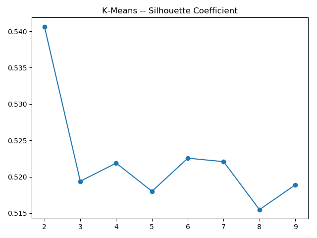

# 大众点评评论用户聚类实验报告

陈柄畅 1753837

## 目录

* [用户距离定义](#用户距离定义)
* [数据预处理](#数据预处理)
* [实验结果](#实验结果)
* [比较分析](#比较分析)

## 用户距离定义

​	传统主流使用TF-IDF对句子进行聚类，但TF-IDF忽略了context以及词语出现顺序对于单个词语和句子表达含义的影响。而Word2Vec模型可以很好地表达出context对词语的影响。但是传统使用句子中出现词语的Word2Vec的平均值来表达句子，这样又忽略了不同词语对句子表达含义的不同影响。而TF-IDF可以衡量给定单词在给定文档集中的重要程度。所以可以将Word2Vec与TF-IDF相结合，使用TF-IDF作Word2Vec的加权平均权重，将两者的加权平均作为评论的特征向量。

​	Doc2Vec是Word2Vec的拓展，基于句子，文档等长文本的模型。但本次实验的数据没有分割每个用户的评论，所以Doc2Vec的效果可能不是特别理想。

​	本次实验采用了Word2Vec平均向量，Word2Vec+TF-IDF加权平均向量，Doc2Vec三种方法进行分析比较。

## 数据预处理

### Word2Vec平均向量

* 使用gensim训练Word2Vec模型并保存。
* 对每个用户评论中所出现的词的词向量进行平均计算并保存。
* 因为训练的Word2Vec模型为300维，较大，利用PCA进行降维。

### Word2Vec+TF-IDF加权平均

* 使用gensim训练Word2Vec模型并且计算TF-IDF值，最后保存数据，避免重复计算。
* 对每个用户进行TD-IDF和Word2Vec的加权平均，并保存。

* 因为训练的Word2Vec模型为300维，较大，利用PCA进行降维。

### Doc2Vec

* 使用gensim训练Doc2Vec模型，迭代1000次并保存模型。
* 将Doc2Vec向量转为特征。
* 因为训练的Doc2Vec模型为300维，较大，利用PCA进行降维。

## 实验结果

### Word2Vec 平均

当选择的类的个数为4时，轮廓系数很高，但是同时SSE也很高。当选择的类的个数为6时，SSE的值低了很多，轮廓系数也很高，所以选择了6类。

* Silhouette Coefficient

* Calinski Harabaz Score

* 每种算法聚类各类中用户个数

| Density Peak | K-Means | DBSCAN | Hierarchical Clustering | Spectral Clustering | EM-GMM |
| :----------: | :-----: | :----: | :---------------------: | :-----------------: | :----: |
|     1783     |  2851   |  9280  |          4405           |        6622         |  2821  |
|     1308     |  3064   |  262   |          1374           |        5260         |  1671  |
|     657      |  1022   |  128   |          2584           |         588         |  3162  |
|     3329     |   553   |  249   |          1946           |         438         |  863   |
|     3699     |  1689   |  131   |           557           |          0          |  552   |
|     2132     |  3729   |   52   |          2042           |          0          |  3839  |

### Word2Vec+TF-IDF平均

对于Word2Vec和TF-IDF加权平均的特征，聚类的个数不是很容易判断，SSE曲线也较为圆滑。所以根据上一个特征所选择的类个数和SSE和轮廓系数取中，选择6类。

* Silhouette Coefficient

* Calinski Harabaz Score

* 每种算法聚类各类中用户个数

| Density Peak | K-Means | DBSCAN | Hierarchical Clustering | Spectral Clustering | EM-GMM |
| :----------: | :-----: | :----: | :---------------------: | :-----------------: | :----: |
|     2893     |  1057   |  9734  |           55            |        9075         |  8099  |
|     7189     |  8024   |   64   |          2967           |          3          |  1085  |
|     584      |    3    |  464   |          4465           |        3757         |   3    |
|     129      |   13    |  110   |          4929           |         73          |  173   |
|     194      |   161   |   34   |           489           |          0          |  3436  |
|     1910     |  3650   |   0    |            3            |          0          |  112   |

### Doc2Vec

当选择的类的个数为2时，轮廓系数很高，但是同时SSE也很高。当选择的类的个数为4时，SSE的值低了很多，轮廓系数仍然处于较高的值，所以选择了4类。

* Silhouette Coefficient

* Calinski Harabaz Score

- 每种算法聚类各类中用户个数

| Density Peak | K-Means | DBSCAN | Hierarchical Clustering | Spectral Clustering | EM-GMM |
| :----------: | :-----: | :----: | :---------------------: | :-----------------: | :----: |
|     5988     |  6987   |  8677  |          8184           |         965         |  7813  |
|     4728     |  2151   |  219   |           875           |        2281         |  2002  |
|     537      |  2896   |   79   |          1984           |         155         |  2242  |
|     1655     |   874   |   51   |          1865           |        9507         |  851   |

## 比较分析

* 在实验的开始阶段，我尝试根据轮廓系数进行调参，对于DBSCAN, Hierarchical Clustering和Spectral Clustering，轮廓系数可以高达0.9以上。但当我查看每一类的用户个数时，发现这三种聚类算法将所有用户几乎聚在一类中，该类占总体用户的98%以上。所以轮廓系数过高，聚类效果也不一定理想。

* 通过观察三种特征，可以发现DBSCAN对于词向量的聚类倾向于聚成一类，即使调整参数降低类中用户个数，DBSCAN则会将其他样本认为是异常点，从而导致聚类的效果并不理想。
* 综合三种特征，可以发现K-Means的聚类效果最好，其次是EM算法。
* 从时间效率上看，Spectral Clustering时间效率最差，当将参数gamma设为太小时，由于设备的限制，在可接受的时间内，已经计算不出结果了。
* 从三种特征聚类的对比上来看，Word2Vec+TF-IDF加权平均和Doc2Vec的结果差于Word2Vec平均的结果。由于训练Word2Vec,Doc2Vec的数据较少而且数据降维可能会损失特征，可能导致词向量并不精确，对于聚类结果也可能存在着影响。