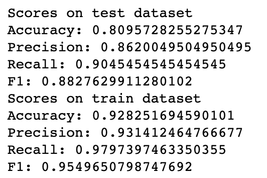
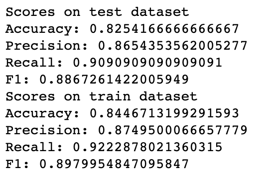

# 点评用户性别预测实验报告

1753837

陈柄畅

## 提取特征

### 用户头像

使用[Clarifai](https://www.clarifai.com)的API对所有用户头像进行语义分析，提取20个标签及其可能性。


### 用户名

参考论文 [中文微博用户性别分类方法研究](/Users/cbc/Project/Python/DAMCourse/Assignment2/Reference/中文微博用户性别分类方法研究.pdf)，使用Jieba对用户名进行分词，提取首字、尾字并根据[HIT中文停用词](https://github.com/goto456/stopwords)和Github上的[英文停用词](https://github.com/Alir3z4/stop-words)过滤掉停用词和出现次数为一次的词。


### 用户评论

使用gensim对每条评论进行Doc2Vec向量化，最后对每个用户的所有评论向量进行平均作为用户的特征向量。


使用SnowNLP对每条评论进行情感分析，最后平均作为用户的特征向量。


### 提供数据的再处理

* 将用户向量展开
* 对`figuration`转换为平均每篇评论中出现的次数
* 将`word_count`转换为平均每篇评论字数及用户发表评论数


**上述数据以及训练集、验证集、测试集均[data](data)文件夹中。**

## 数据预处理

在Logistic Regression, SVM, Random Forest分类之前对数据进行了归一化处理。

在Neural Network (多层感知器) 分类之前，由于`solver`使用`adam`, 所以对数据进行了标准化处理。

## 特征选取

本次实验分为提取特征、提供的特征和所有特征（由于提取特征和提供的特征中对于review向量化重复，故只选取Doc2Vec）三种特征选取方式进行实验。

另外，在所有特征的实验中，分别删除评论情感，表情符号统计两个特征，分类准确度都有所降低。

## 参数设定

### SVM

训练样本的特征数量巨大，不需要通过RBF等非线性核函数将其映射到更高的维度空间上，利用非线性核函数也并不能提高分类器的性能。利用linear核函数就可以获得足够好的结果。

### Random Forest

尝试了在验证集调整一系列参数，但效果都不如默认参数好。。。

### Neural Network

* 自己提取的特征

```python
MLPClassifier(hidden_layer_sizes=[100,100,10],max_iter=1000,random_state=33,alpha=5)
```

三层隐藏层，每层分别100、100、10个神经元，正则化系数为5

* 提供的特征

```python
MLPClassifier(hidden_layer_sizes=[20,20,10],max_iter=1000,random_state=33)
```

三层隐藏层，每层分别20、20、10个神经元，正则化系数为0.0001

* 所有的特征

```python
MLPClassifier(hidden_layer_sizes=[100,10,10],max_iter=1000,random_state=33,alpha=1)
```

三层隐藏层，每层分别100、10、10个神经元，正则化系数为1

由于设备限制，神经网络只选择了三层进行了调参。

## 实验结果

参考论文[Cross-domain gender detection in Twitter](Reference/Cross-domain gender detection in Twitter.pdf), 使用stacking作为集成学习模型，meta classifier使用`Logistic Regression`。

|                                |        My Feature         |       Given Feature       |            All            |
| ------------------------------ | :-----------------------: | :-----------------------: | :-----------------------: |
| Logistic Regression            |    |    |    |
| Logistic Regression + Stacking |   |   |   |
| SVM                            |   |   |   |
| SVM + Stacking                 |  |  |  |
| Random Forest                  |    |    |    |
| Random Forest + Stacking       |   |   |   |
| LR + SVM +RF + Stacking        |   |   |   |
| Neural Network                 |    |    |    |

由于采用了多种方法，实验结果文件无法按照作业要求的格式进行展示。故采用下列格式：

| user_id |          lr_label           |               lrs_label                |  svm_label  |       svms_label       |       rf_label        |            rfs_label             |            mix_label            |        nn_label        | true_label |
| ------- | :-------------------------: | :------------------------------------: | :---------: | :--------------------: | :-------------------: | :------------------------------: | :-----------------------------: | :--------------------: | :--------: |
| 用户id  | Logistic Regression预测结果 | Logistic Regression + Stacking预测结果 | SVM预测结果 | SVM + Stacking预测结果 | Random Forest预测结果 | Random Forest + Stacking预测结果 | LR + SVM +RF + Stacking预测结果 | Neural Network预测结果 |   实际值   |

## 比较分析

* 集成学习对于多个相同的基分类器的提升效果不大
* 由于随机森林本身就是集成学习模型，stacking对其准确度有所提升，但也增加了其过拟合的程度。
* 神经网络在分类时也极易发生过拟合的现象，但可以通过简化神经网络和增大正则化系数进行减少。
* 对于本数据集，LR + SVM +RF + Stacking 和 Neural Network 的方法分类效果最好。时间效率上看，SVM + Stacking的方法效率最低。
* 同一算法对不同特征的表现有所差异，不同算法分别使用适用于不同特征，但LR + SVM +RF + Stacking 和 Neural Network在不同特征集上的效果都很不错。

## 改进

由于时间和设备的限制，本次实验仍有一些可以改进的地方。

* 随机森林存在着过拟合的情况，但计算设备有限，没有能够调整参数到合理水平。
* 尝试对于特征选取进行更加细致的调试
* 尝试其他集成学习模型
* 尝试不同的神经网络模型
* 尝试不同的meta classifier